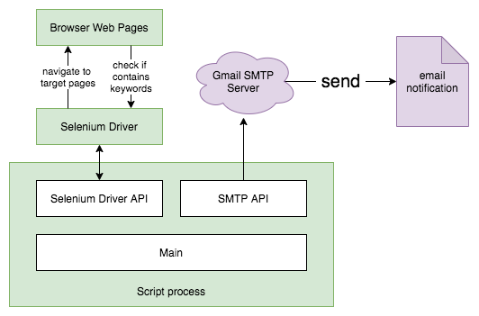

# Notify me when my desired job posting is updated

### Why use Selenium instead of simple HTTP GET?
- HTTP GET only returns static information, while many websites render contents dynamically. Therefore, we need a browser to do the rendering~

### What is `os_cpu_specific_bin`?
- The directory contains binary executable files for specific operating system with specific CPU.
- My Raspberry Pi has a weak CPU which supports limitted versions of Selenium drivers. Check [here](https://github.com/lukeZhangMengxi/raspi_scripts/tree/master/jobs_notify/os_cpu_specific_bin/linux_armv7l) for more details.
- Move relevant binary executables into the Python virtual environment to make them visible to the script runtime.
